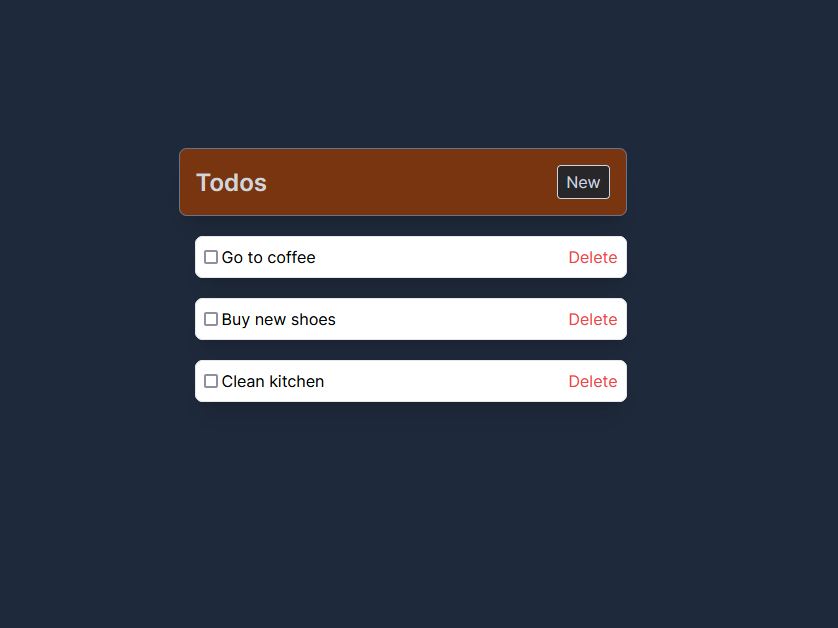
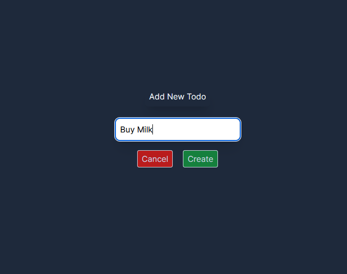

# nextjs-project

A nextjs project with typescript, tailwind CSS and Prisma as a database.

## Table of Contents

- [Preview](#preview)
- [Installation](#installation)
- [Usage](#usage)

## Preview
Preview of the project.




## Installation

Step-by-step instructions on how to get the development environment set up.

```bash
# Clone the repository
git clone https://github.com/JoniMustaniemi/nextjs-project.git

# Navigate to the project directory
cd nextjs-project

# Install dependencies
npm install
```
## Usage
Start the project.
```bash
npm run dev
```

and then navigate to http://localhost:3000/ with the chosen browser.
